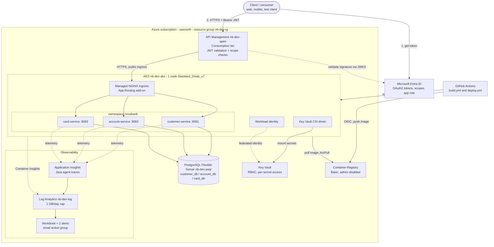
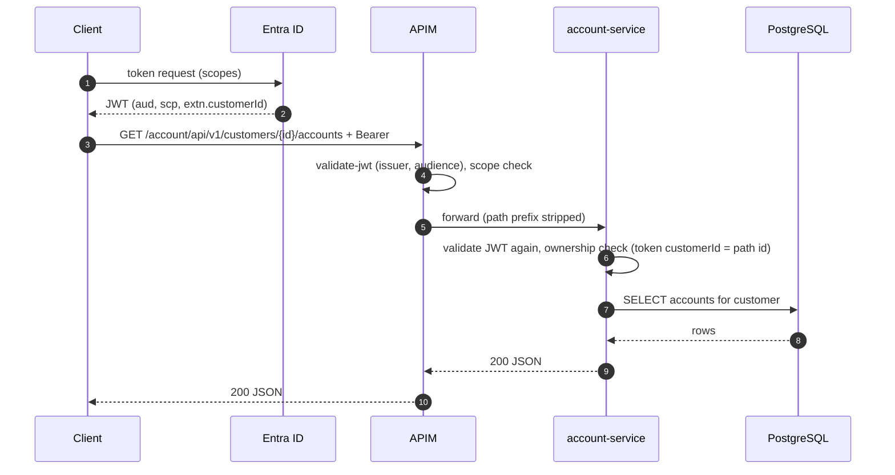
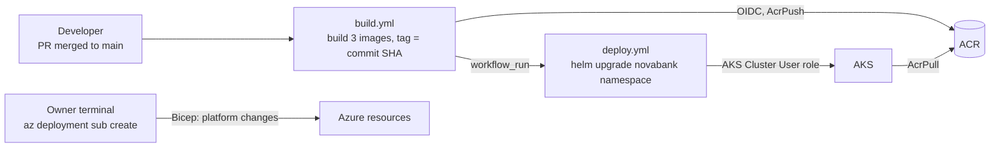

# NovaBank Platform — High-Level Design (HLD)

| | |
|---|---|
| **Document** | High-Level Design, NovaBank Platform (Project 2) |
| **Version / date** | 1.0 — 2026-10-04 |
| **Owner** | Mohammad Ibrahim Badsha (Enterprise Architect) |
| **Status** | Stages 1-6 built and verified. Stage 7 (private networking) designed, costed, **paused** |
| **Environment** | `dev` — single environment, Azure region UAE North (`uaenorth`), resource group `nb-dev-rg` |
| **Related docs** | `architecture.md` (per-stage detail), `runbook.md` (operations), `cost-log.md` (spend), `BUILD_PLAN_PLATFORM.md` (stage plan) |

All data in NovaBank is **synthetic**. NovaBank is a fictional digital bank built as a portfolio platform.

---

## 1. Purpose and scope

NovaBank Core (Project 1) provides three banking REST APIs. This platform (Project 2) is the
Azure runtime that hosts them: it builds, deploys, secures, observes and operates the services
so that later projects (AI enquiry assistant, KYC, fraud model) can consume the APIs.

**In scope:** infrastructure as code, container build and deploy pipeline, API gateway and
identity, secrets, database hosting, observability, cost controls.
**Out of scope:** the business logic of the APIs (Project 1), high availability and disaster
recovery (dev environment), multi-region, production-grade private networking (Stage 7, paused).

### Design principles
1. **Everything as code** — Bicep for Azure, Helm for Kubernetes, a script for Entra ID. Rebuildable from the repo.
2. **No stored cloud credentials** — GitHub uses OIDC federation, pods use workload identity.
3. **Least privilege** — every role assignment is scoped to the single resource that needs it, down to individual secrets.
4. **Defence in depth** — a JWT is validated twice (gateway, then service) and each service enforces data ownership itself.
5. **Cost first** — the cheapest SKU that works, and billed-by-the-hour resources are stopped between sessions.
6. **Separation of duties** — platform changes are deployed by the owner from a terminal; application changes flow through the pipeline.

---

## 2. Cloud architecture

> **Current state is public.** APIM, the AKS ingress, PostgreSQL, Key Vault and ACR all have
> public endpoints, restricted by authentication, RBAC and (for Postgres) firewall rules.
> Section 9 describes the private-networking target and why it is paused.

---

## 3. Components

| Layer | Resource | Configuration | Role |
|---|---|---|---|
| Identity | Microsoft Entra ID | One API app registration (self-referential client), scopes `accounts.read`, `cards.read`, `cards.write`, `transfers.write`, app role `NovaBank.Staff`, directory extension `customerId` emitted as the `extn.customerId` claim; a second minimal read-only client; test users | Issues tokens; the claim ties a token to one customer |
| Edge | API Management `nb-dev-apim` | **Consumption** tier; three APIs (`/customer`, `/account`, `/card`) in one product; policy validates issuer and audience, then checks scope per operation | Front door, layer-1 authorization |
| Compute | AKS `nb-dev-aks` | Free control-plane tier; 1 node `Standard_D4als_v7` (4 vCPU / 8 GB); Azure CNI overlay; OIDC issuer; workload identity; App Routing ingress; Key Vault CSI driver; Container Insights | Runs the three services |
| Services | `customer-service`, `account-service`, `card-service` | Java 21, Spring Boot 4.1.1, one Helm chart shared by all three; startup probe up to 300 s; Hikari pool capped at 5 | Business APIs; layer-2 authorization and ownership check |
| Data | PostgreSQL Flexible Server `nb-dev-psql` | Postgres 16, Burstable `Standard_B1ms`, 32 GB, no HA, 7-day backups, `max_connections` 50; one database and one role per service; Flyway migrations | System of record, one database per service |
| Secrets | Key Vault | RBAC mode; DB passwords, App Insights connection string, test-user password | Secret store; synced to pods by the CSI driver |
| Registry | Container Registry | Basic SKU, admin user disabled | Image store; `AcrPush` for the pipeline, `AcrPull` for the cluster |
| CI/CD | GitHub Actions | `build.yml` then `deploy.yml`, authenticated via OIDC to a user-assigned managed identity | Build, push, deploy |
| Observability | Application Insights, Log Analytics, workbook, alerts | Workspace-based; Java agent 3.7.10; 1 GB/day ingestion cap | Traces, logs, dashboards, alerting |
| Cost | Budget `nb-dev-budget`, `scripts/stop.sh` / `start.sh` | $25/month alert at 50/80/100 % | Spend control |

**Service boundaries:** `customer-service` owns customers; `account-service` owns accounts,
balances, transactions and transfers (kept together so a balance and its postings change in one
database transaction); `card-service` owns cards. Services never read each other's database.

---

## 4. Request flow and security model

### Security layers

| Layer | Control | Failure result |
|---|---|---|
| 1. APIM | Valid signature, issuer and audience; required scope for the operation (`accounts.read` for reads, `transfers.write` for POST) | `401` no/invalid token, `403` missing scope |
| 2. Service | Independent JWT validation (including audience), then ownership check: the token's `extn.customerId` must equal the customer in the URL; staff role bypasses | `404` for another customer's data (never confirms it exists) |
| 3. Data | Each service connects with its own database role to its own database | Cannot read another service's data |
| 4. Secrets | Per-secret `Key Vault Secrets User` per service identity; no passwords in code or images | An identity can read only its own secrets |

The four scenarios (own data `200`, other customer `404`, missing scope `403`, no token `401`)
are demonstrated in `stage5-security-scenarios.http` and were verified live.

---

## 5. CI/CD and change control

| Path | What it changes | Who | Why separate |
|---|---|---|---|
| Pipeline | Application images and Helm releases | GitHub Actions, automatic on merge to `main` | Fast, repeatable, no human credentials |
| Owner-deployed | Infrastructure (Bicep), Entra ID (script), Postgres roles (script) | The owner, from a terminal | Mirrors regulated change control; the pipeline identity cannot alter infrastructure |

Images are tagged with the commit SHA, so every deployment is traceable and rollback is a
`helm rollback` to a previous release.

---

## 6. Observability

| Capability | Implementation |
|---|---|
| Distributed traces | Application Insights Java agent attached in each image; auto-instruments HTTP and JDBC with no code changes; one cloud role name per service |
| Logs and platform metrics | Container Insights into the shared Log Analytics workspace |
| Dashboard | Workbook: request rate, error rate (%), latency (average and P95), pod restarts |
| Alerts | 5xx rate above 5 in 5 minutes; pod `BackOff` (crash loop) event; both email the owner |
| Cost control | One workspace, 1 GB/day cap shared by Container Insights and App Insights |

A verified trace shows the request on `account-service`, an HTTP call to Entra (first request
only, JWT key fetch, ~380 ms) and the PostgreSQL query (~1-13 ms). First call ~737 ms, later
calls ~8 ms. **Gap:** APIM is not yet connected to Application Insights, so the gateway hop is
not in the trace.

---

## 7. Non-functional characteristics

| Attribute | Current design | Notes |
|---|---|---|
| Availability | Single node, single replica per service, no database HA | Deliberate for a dev environment; a node or pod restart means brief downtime |
| Scalability | Manual; one node with spare capacity after the 4 vCPU resize | Horizontal scaling is a Helm value; the database connection limit (50) is the first constraint |
| Recovery | PostgreSQL 7-day backups; all infrastructure and deployments rebuildable from the repo | No cross-region copy |
| Security | Layered JWT checks, least-privilege RBAC, no stored cloud credentials | Endpoints are public in the current state |
| Performance | Warm requests ~8 ms at the service | Cold first request dominated by Entra key fetch |
| Operability | Runbook with troubleshooting from real incidents; stop/start scripts | See `runbook.md` |
| Cost | See section 8 | Stopping AKS and Postgres removes most spend |

---

## 8. Cost

All figures are monthly estimates; confirm against the first bills. Hourly resources are only
charged while running.

| Resource | If run continuously | Billing note |
|---|---|---|
| AKS node `Standard_D4als_v7` | ~$144 | Hourly; stopped by `stop.sh`. Resized from 2 vCPU (~$72) after the smaller node could not keep system pods healthy |
| PostgreSQL B1ms | ~$12-20 | Hourly; stopped by `stop.sh` (auto-restarts after 7 days if left stopped) |
| Standard load balancer | ~$18 | Tied to the cluster's existence, not its power state |
| Public IPs (outbound + ingress) | ~$7 | Same |
| Container Registry Basic | ~$5 | Fixed |
| Log Analytics / App Insights | ~$0-5 | Well under the 1 GB/day cap at this volume |
| APIM Consumption, Key Vault, Entra ID | ~$0 | Pay per call or operation; the free tier covers demo volume |
| **Total, running continuously** | **~$190-215** | |
| **Total, with AKS and Postgres stopped** | **~$25-30** | Load balancer, IPs and registry keep billing |

The $25/month budget alert is expected to fire when the platform runs for long periods.

---

## 9. Network posture and Stage 7 (paused)

### Inbound paths today

| Path | Why it exists | Protection |
|---|---|---|
| Internet to APIM | The intended front door | JWT validation, scope checks |
| Internet to AKS ingress | Public App Routing ingress (APIM Consumption cannot reach a private backend) | Each service validates the JWT and enforces ownership |
| Internet to PostgreSQL | Owner access for migrations and seeding | Firewall allows only the owner's IP and the cluster's outbound IP; TLS required |
| Internet to Key Vault and ACR | Control and data plane | Entra authentication and RBAC only; no network restriction |
| Internet to AKS API server | `kubectl` and pipeline deploys | Entra authentication and RBAC |

### Stage 7 target and decision

The target is the "one front door" design: a VNet with private DNS, PostgreSQL with private
access, a Key Vault private endpoint, an internal ingress reachable only from APIM, and an
API server restricted to authorized IP ranges.

| Constraint found during design | Consequence |
|---|---|
| **APIM Consumption cannot join a VNet** | Meeting "APIM is the only public entry point" needs APIM Developer tier or above (~$48/month, cannot be stopped) in external VNet mode |
| Existing AKS cannot be moved into a custom VNet; existing Postgres cannot switch from public to private | Both are recreated; Flyway rebuilds the schema and the data is synthetic |
| ACR private endpoint requires Premium (~$50 vs ~$5/month) | Recommended exception: keep ACR public with Entra-only auth |
| Authorized IP ranges on the API server break GitHub-hosted deploys | Deploy via `az aks command invoke` |
| Private Postgres removes laptop access | Migrations and role scripts need an in-cluster path |

| Option | Extra per month | Outcome |
|---|---|---|
| A. Full design, APIM Developer | ~+$57 | Only public entry point is APIM; databases unreachable from the internet |
| B. Private database and Key Vault only | ~+$9 | Ingress stays public; "single front door" documented as not met |

**Decision:** paused on 2026-10-04 on cost grounds. The platform stays in its current public
state with the compensating controls above.

---

## 10. Key decisions

| Decision | Rationale | Trade-off |
|---|---|---|
| Bicep, not Terraform | Azure-native, no state file | Azure-only |
| AKS, not Container Apps | Matches the target skill story and client demand | Higher cost and complexity |
| One shared Helm chart | The three services are identical in shape | Less per-service flexibility |
| APIM Consumption | Pay per call, near-zero cost | No VNet integration |
| Self-referential Entra app, audience is the raw app ID | Simplest model for a single API | Tokens carry the GUID as `aud`, not an `api://` URI |
| Key Vault CSI mounts and syncs secrets | Workload identity, no secrets in manifests | Synced Kubernetes Secrets do not refresh on their own (rotation disabled) |
| Startup probe instead of long initial delays | JVM plus agent start slowly under CPU limits | A broken pod takes up to 5 minutes to be declared failed |
| Hikari pool capped at 5 | Postgres B1ms allows 50 connections | Lower per-pod concurrency |
| Deterministic secrets (`uniqueString()`), not `newGuid()` | `newGuid()` re-rolls on every deploy and desynchronised Key Vault from the database | Values derive from deployment inputs |

## 11. Risks, limitations and follow-ups

| # | Item | Impact | Next step |
|---|---|---|---|
| 1 | Public endpoints on ingress, database, Key Vault, ACR | Reliance on authentication rather than network isolation | Stage 7, option A, when budget allows |
| 2 | Single node, single replicas, no HA | Downtime on node or pod loss | Accepted for dev |
| 3 | APIM not wired to Application Insights | Gateway hop missing from traces | Add an APIM logger and diagnostic setting |
| 4 | 5xx alert has fired in an incident but had no controlled test | Lower confidence in that alert | Generate repeated 5xx and confirm |
| 5 | Postgres connection ceiling of 50 | Rollouts and extra replicas can exhaust slots | Keep the pool cap; consider a larger SKU before scaling out |
| 6 | Entra setup is a script, not Bicep | Not fully declarative | Documented in `scripts/setup-entra-id.sh` |
| 7 | Stopped Postgres auto-restarts after 7 days | Unexpected cost | Re-run `scripts/stop.sh` |

## 12. Build status

| Stage | Outcome |
|---|---|
| 1. Foundations | Complete — resource group, Log Analytics, budget |
| 2. Registry and pipeline | Complete — ACR, OIDC federation, image build |
| 3. Database and secrets | Complete — Postgres, Key Vault, per-service identities |
| 4. AKS deployment | Complete — AKS, Helm chart, workload identity, ingress |
| 5. APIM and Entra ID | Complete — four security scenarios verified live |
| 6. Observability | Complete — end-to-end trace and alert verified |
| 7. Private networking | Designed and costed; paused |
