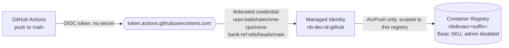
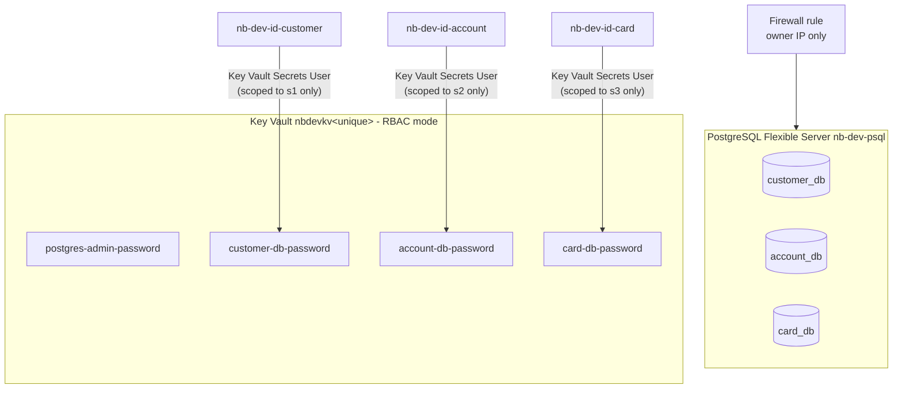
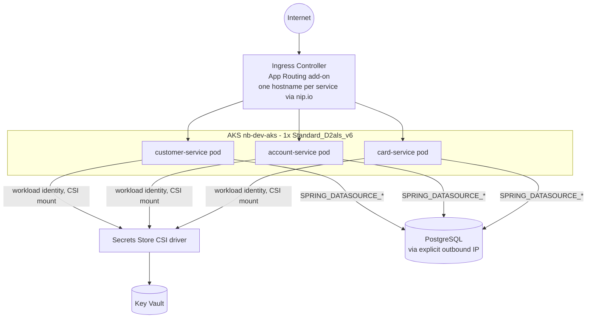

# NovaBank Platform — Architecture

Living document, updated at the end of every stage. Each stage adds its resources and
the reasoning behind them; nothing here is deleted as later stages extend it, except to
reflect things that were actually replaced (e.g. public access removed in Stage 7).

## Stage 1 — Foundations

| Resource | Name | Purpose |
|---|---|---|
| Resource group | `nb-dev-rg` | Scope for every dev resource in this project; everything else gets deployed into it |
| Log Analytics workspace | `nb-dev-log` | Central log/metric sink for later stages (Container Insights in Stage 4, Application Insights in Stage 6). Empty and free until something ingests into it |
| Budget | `nb-dev-budget` | $25/month cost tripwire at the resource-group scope, emailing `m.ibbrahim45@gmail.com` at 50/80/100% of spend |

### Decisions
| Decision | Why | Trade-off |
|---|---|---|
| Subscription-scope `main.bicep` | Resource groups are themselves subscription-scoped resources; this lets one `az deployment sub create` create the RG and everything inside it in one pass | Slightly more ceremony than a resource-group-scoped template (need `scope: rg` on each module) |
| Budget scoped to the resource group, not the subscription | All project spend lives in `nb-dev-rg` by design (single dev environment); a resource-group-scoped budget tracks exactly that | If a future stage creates resources outside this RG, they won't count against the budget |
| Log Analytics PerGB2018 (pay-as-you-go) tier | Cheapest SKU that still supports Container Insights / App Insights later; no commitment tier needed at this volume | Per-GB ingestion cost instead of a flat commitment rate — fine at dev-scale log volume |
| UAE North region | Low latency to the owner; full-featured Azure region (AKS, PostgreSQL Flexible Server, APIM all available) | — |

### Naming and tagging applied
- Convention: `nb-<env>-<resource-abbreviation>`
- Tags on every resource: `project=novabank`, `env=dev`, `owner=badsha`, `managedBy=bicep`

## Stage 2 — Container registry + build pipeline

| Resource | Name | Purpose |
|---|---|---|
| Container Registry | `nbdevacr<unique>` | Stores the 3 service images; Basic SKU, admin user disabled |
| User-assigned managed identity | `nb-dev-id-github` | Stands in for GitHub Actions in Azure — no stored credential, ever |
| Federated identity credential | `github-actions-main` (on the identity) | Lets only workflow runs triggered by a push to `main` on `badshatechme-cpu/nova-bank` exchange a GitHub OIDC token for an Azure AD token |
| Role assignment | `AcrPush` → scoped to the registry | The identity can push/pull images on this one registry and nothing else — can't touch any other resource in the subscription |

**Pipeline:** `.github/workflows/build.yml` builds `customer-service`, `account-service`, and `card-service` on every push to `main`, tags each image with the commit SHA, and pushes to ACR via `az acr login` (using the OIDC-authenticated identity) + `docker push`.

**GitHub repo variables** (not secrets — safe by design since there's no credential behind them, only identifiers used to request a short-lived token): `AZURE_CLIENT_ID`, `AZURE_TENANT_ID`, `AZURE_SUBSCRIPTION_ID`, `ACR_NAME`.

### Decisions
| Decision | Why | Trade-off |
|---|---|---|
| User-assigned managed identity, not an Entra ID app registration | Managed identities (and their federated credentials) are native ARM/Bicep resources; app registrations are Microsoft Graph objects that need a separate extension or a deployment-script workaround to manage as code | Slightly less common pattern in older GitHub OIDC tutorials, which mostly show app registrations |
| Federated credential subject locked to `ref:refs/heads/main` | Only a push-triggered run on `main` can authenticate as this identity — a PR build or a run on any other branch gets no token | Need a second federated credential (or a broader subject) later if we want PR-triggered builds |
| Subject keyed on GitHub's numeric owner/repo IDs (`repo:owner@ownerId/repo@repoId:ref:...`), not names | This is the subject format GitHub's OIDC provider actually issues — found by reading the failed first run's own log output. Using stable IDs also means a future repo/org rename won't silently break the credential | Less readable in the Bicep source than the plain `owner/repo` form; the IDs have to be looked up once via the GitHub API |
| `AcrPush` scoped to the registry resource, not the resource group | Least privilege: this identity's blast radius is "can push/pull images to this one registry" | If a second registry is ever added, it needs its own role assignment |
| ACR admin user disabled | No static admin password exists to leak; every push is OIDC-authenticated | Can't `docker login` with a username/password for quick manual testing — use `az acr login` instead |
| ACR Basic SKU | Cheapest tier (~$5/month); no geo-replication or private endpoint support needed yet | Upgrade to Premium only if Stage 7 needs a private endpoint on the registry |

## Stage 3 — Database and secrets

| Resource | Name | Purpose |
|---|---|---|
| PostgreSQL Flexible Server | `nb-dev-psql` | Burstable `Standard_B1ms`, Postgres 16, 32GB storage, no HA, 7-day backups |
| Firewall rule | `allow-owner-ip` | Public access restricted to the owner's single IP — Stage 7 removes public access entirely |
| Databases | `customer_db`, `account_db`, `card_db` | Created empty; Flyway migrates the schema when the services connect in Stage 4 |
| Key Vault | `nbdevkv<unique>` | RBAC mode (no legacy access policies) |
| Role assignment | `Key Vault Secrets Officer` → owner, scoped to the vault | Lets the owner's own deployment write the secrets below |
| Secrets | `postgres-admin-password`, `customer-db-password`, `account-db-password`, `card-db-password` | Deterministic per-environment value (see Stage 4's note on why this isn't `newGuid()`); never written to a file in the repo |
| Managed identities | `nb-dev-id-customer`, `nb-dev-id-account`, `nb-dev-id-card` | One per service, used in Stage 4 to pull each service's own DB password at runtime |
| Role assignments | `Key Vault Secrets User`, scoped to **one secret each** | `nb-dev-id-customer` can read `customer-db-password` only — not the admin password, not another service's password |

**Manual one-time step:** `scripts/create-db-roles.sh` creates the three per-service Postgres roles (`customer_app`, `account_app`, `card_app`), reading their passwords live from Key Vault. Postgres roles aren't an ARM/Bicep resource type — the only declarative alternative is an Azure deployment-script resource, which spins up a temporary container and storage account just to run a few SQL statements, and needs the firewall opened to "all Azure services" to reach the database. Running a short script yourself instead avoids that cost/complexity and keeps the live-database connection in the owner's hands, consistent with the platform/application change-control split.

### Decisions
| Decision | Why | Trade-off |
|---|---|---|
| Per-service DB passwords generated now, Postgres roles created via a manual script | Postgres users/roles have no ARM resource type; a deployment-script workaround adds cost, complexity, and a firewall exception | Two steps instead of one — Bicep deploy, then run `create-db-roles.sh` |
| Key Vault Secrets User scoped per-secret, not per-vault | Demonstrates real secret-level least privilege: a compromised service identity can only ever read its own DB password | Three near-identical role assignments instead of one vault-wide grant |
| Firewall restricted to the owner's single IP | Smallest possible exposure while the owner is the only one connecting (schema migrations, manual checks) | Breaks if the owner's IP changes (home network, VPN) — re-run the deployment with the new IP, or widen temporarily |
| Burstable `Standard_B1ms`, no HA | Cheapest SKU that still runs Postgres 16 reliably for dev/demo traffic (~$12-20/month) | No failover; acceptable for a non-production portfolio environment |

## Stage 4 — AKS and first deployment

| Resource | Name | Purpose |
|---|---|---|
| AKS cluster | `nb-dev-aks` | Free tier, 1x `Standard_D2als_v6` system node, OIDC issuer + workload identity, Secrets Store CSI driver, App Routing (managed NGINX ingress), Container Insights → `nb-dev-log` |
| Outbound public IP | `nb-dev-aks-outbound-ip` | Explicitly provisioned (not AKS's auto-managed one) so Bicep can feed its address straight into the Postgres firewall |
| Federated credentials | `aks-workload-identity` on each Stage 3 identity | Subject `system:serviceaccount:novabank:<service>-service`, issuer = the cluster's own OIDC issuer — pods authenticate to Key Vault with zero stored credentials |
| Role assignments | `AcrPull` → AKS kubelet identity (scoped to the registry); `Azure Kubernetes Service Cluster User Role` → the GitHub pipeline identity (scoped to the cluster) | Nodes can pull images; the pipeline can fetch a kubeconfig and deploy — nothing more |
| Helm chart | `deploy/helm/novabank-service/` | One shared chart, three values files; Deployment (liveness/readiness on Actuator, low resource requests), ServiceAccount (workload identity annotated), SecretProviderClass (Key Vault → mounted file + native K8s Secret), Service, Ingress |
| Pipeline | `.github/workflows/deploy.yml` | Triggered by `workflow_run` once `build.yml` succeeds on `main`; same OIDC identity, `helm upgrade --install` per service with the built commit SHA as the image tag |

### What actually went wrong, and the fixes (all real, all worth keeping)

| Problem | Root cause | Fix |
|---|---|---|
| `Standard_B2s` rejected at deploy | Fresh pay-as-you-go subscriptions start with **zero Burstable-family quota** in most regions | Switched to `Standard_D2als_v6` (general-purpose, in the subscription's allowed-SKU list) — costs more (~$72/mo vs ~$30/mo if left running), mitigated by `stop.sh`/`start.sh` |
| AKS deployment failed: `MissingSubscriptionRegistration` for `Microsoft.OperationsManagement` / `Microsoft.Insights` | Fresh subscriptions don't pre-register every resource provider; Container Insights needs both | `az provider register --namespace <ns>` once, then redeploy — one-time per subscription |
| 3 app pods stuck `Pending`: `Insufficient cpu` | A single small node's **CPU requests** (not actual usage) were ~95-98% consumed by AKS's own add-ons (ingress, Container Insights, CSI driver, workload identity webhook) before any app pod was scheduled | Lowered the chart's default CPU request from 100m → 20m. The Azure Portal's node CPU% shows *actual usage* (was only ~22%); the scheduler only looks at *requests* — these are different numbers and both matter for different reasons |
| Pods crash-looped: `password authentication failed` | Postgres's firewall only allowed the **owner's own IP** (Stage 3) — pods reach Postgres through **AKS's outbound IP**, which isn't the same address | Explicitly provisioned an outbound public IP in Bicep (`modules/aks.bicep`) and added a second Postgres firewall rule for it, so this stays correct even if the cluster is rebuilt |
| Pods crash-looped again after a later fix: same password error, different password | `postgresAdminPassword`/`*DbPassword` defaulted to `newGuid()`, which **re-evaluates on every single `az deployment sub create` run** — not just the first. Three unrelated redeploys (VM size, provider registration, outbound IP) each silently rotated all 4 Key Vault secrets, desyncing them from whatever `create-db-roles.sh` had actually set on the live Postgres roles | Switched the 4 password parameters to a **deterministic** `uniqueString()`-based expression (seeded by subscription ID + a fixed per-secret label) — same value every redeploy, forever, while still never appearing as a literal in the repo |
| Pods still crash-looped immediately after the deterministic-password fix + re-running `create-db-roles.sh` | The Secrets Store CSI driver's `secretObjects` sync creates a **native Kubernetes Secret once**; with `enableSecretRotation: 'false'`, that Secret object is never refreshed by anything short of deleting it — restarting the *pod* alone doesn't touch the already-existing Secret | Deleted the 3 stale `<service>-db-secret` objects directly so the CSI driver recreated them from Key Vault's current value on the next mount |

### Decisions
| Decision | Why | Trade-off |
|---|---|---|
| General-purpose `Standard_D2als_v6`, not Burstable | The only path that actually works on this subscription without a support-ticket wait for quota | ~2.4x the cost of the original estimate if left running continuously |
| One shared outbound public IP, explicit in Bicep | Keeps "which IP can reach Postgres" fully declared and reproducible, instead of a value you'd have to look up and hand-enter after every cluster rebuild | One more resource (~$3-4/month) |
| Deterministic secrets instead of `newGuid()` | `newGuid()` is the textbook Bicep pattern for *first-time* secret generation, but nothing in that pattern stops it from firing again on every later redeploy — we hit that the hard way | Secure-parameter-default linter warning (expected and accepted — the whole point is that these are *not* fresh randomness each run) |
| CSI secret rotation left disabled | Keeps the cluster simpler and avoids an extra reconciliation loop running constantly for a 3-pod dev cluster | Any future password change requires manually deleting the synced Secret (documented in the runbook) rather than it refreshing on its own |
| `nip.io` hostnames instead of path-based ingress routing | The account/card APIs nest under `/api/v1/customers/{id}/...`, the same prefix customer-service itself owns — simple path routing would collide between services | Not a real custom domain; Stage 5's APIM replaces this with proper OpenAPI-aware routing |
