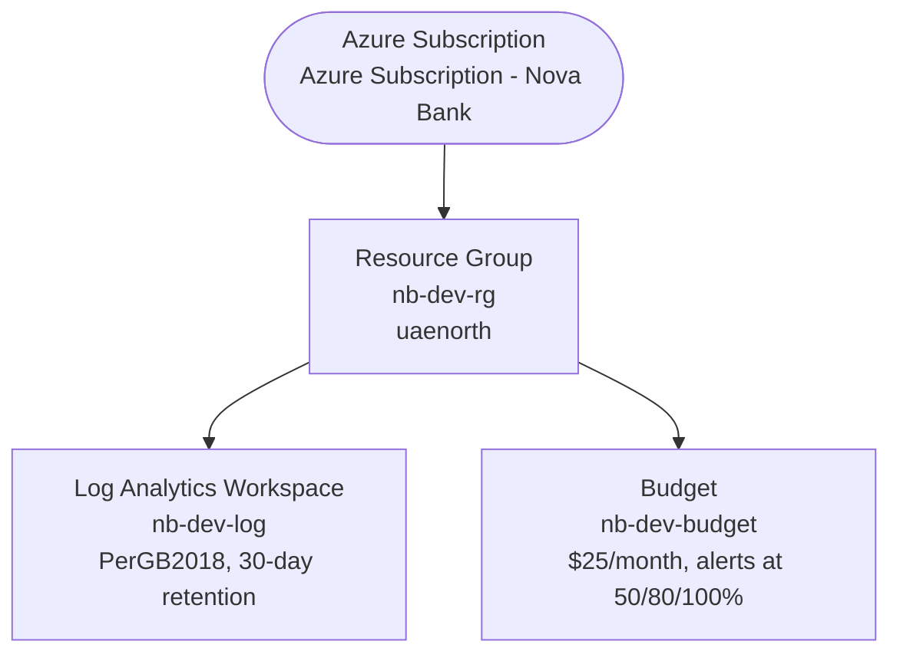

# NovaBank Platform — Architecture

Living document, updated at the end of every stage. Each stage adds its resources and
the reasoning behind them; nothing here is deleted as later stages extend it, except to
reflect things that were actually replaced (e.g. public access removed in Stage 7).

## Stage 1 — Foundations

| Resource | Name | Purpose |
|---|---|---|
| Resource group | `nb-dev-rg` | Scope for every dev resource in this project; everything else gets deployed into it |
| Log Analytics workspace | `nb-dev-log` | Central log/metric sink for later stages (Container Insights in Stage 4, Application Insights in Stage 6). Empty and free until something ingests into it |
| Budget | `nb-dev-budget` | $25/month cost tripwire at the resource-group scope, emailing `m.ibbrahim45@gmail.com` at 50/80/100% of spend |

### Decisions
| Decision | Why | Trade-off |
|---|---|---|
| Subscription-scope `main.bicep` | Resource groups are themselves subscription-scoped resources; this lets one `az deployment sub create` create the RG and everything inside it in one pass | Slightly more ceremony than a resource-group-scoped template (need `scope: rg` on each module) |
| Budget scoped to the resource group, not the subscription | All project spend lives in `nb-dev-rg` by design (single dev environment); a resource-group-scoped budget tracks exactly that | If a future stage creates resources outside this RG, they won't count against the budget |
| Log Analytics PerGB2018 (pay-as-you-go) tier | Cheapest SKU that still supports Container Insights / App Insights later; no commitment tier needed at this volume | Per-GB ingestion cost instead of a flat commitment rate — fine at dev-scale log volume |
| UAE North region | Low latency to the owner; full-featured Azure region (AKS, PostgreSQL Flexible Server, APIM all available) | — |

### Naming and tagging applied
- Convention: `nb-<env>-<resource-abbreviation>`
- Tags on every resource: `project=novabank`, `env=dev`, `owner=badsha`, `managedBy=bicep`
